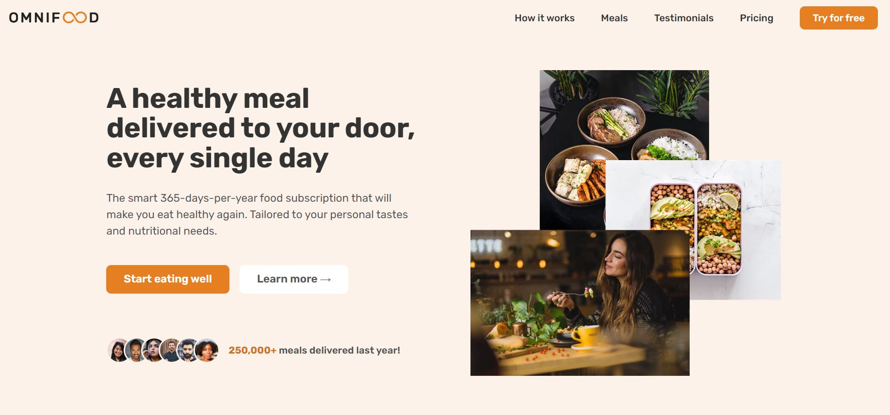

# OMNIFOOD



## Deskripsi
Selamat datang di proyek website pertama saya yang dibuat dengan HTML dan CSS! Website ini bernama **omnifood**, sebuah platform katering makanan sehat yang menggunakan AI untuk memilih menu makanan sesuai dengan kriteria pengguna. Dengan omnifood, Anda bisa mendapatkan rekomendasi menu yang sehat dan lezat tanpa repot!
## Fitur
- **Responsif**: Desain yang menyesuaikan dengan berbagai ukuran layar, dari desktop hingga perangkat mobile.
- **HTML Semantik**: Menggunakan elemen-elemen HTML5 semantik untuk meningkatkan aksesibilitas dan SEO.
- **CSS Modern**: Menggunakan flexbox dan grid layout untuk tata letak yang fleksibel dan efisien.
- **JavaScript**: Menggunakan sedikit JavaScript untuk interaktivitas tambahan.
- **Kompatibilitas Browser**: Dapat dijalankan di semua browser modern.

## Teknologi yang Digunakan
- **HTML5**: Untuk struktur dan konten web.
- **CSS3**: Untuk styling dan layout, menggunakan flexbox dan grid.
- **JavaScript**: Untuk interaktivitas tambahan.
- **SEO Friendly**: Teknik SEO dasar untuk meningkatkan visibilitas mesin pencari.
- **Kompatibilitas Browser**: Dapat dijalankan di semua browser modern.

## Cara Menggunakan
1. **Clone Repository**:
   ```sh
   git clone https://github.com/username/PROJECT-Omnifood.git

