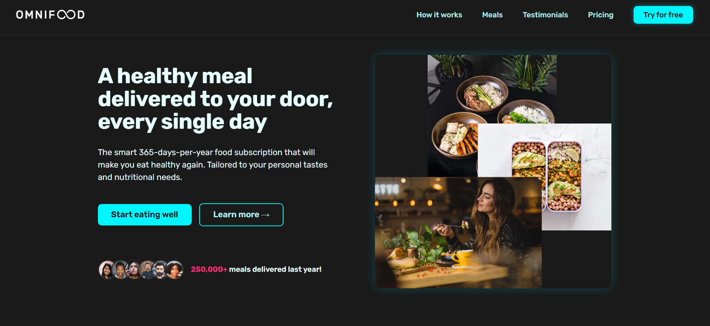

# OMNIFOOD



## Description

Welcome to my first website project built with HTML and CSS! This website is named Omnifood, a healthy food catering platform that uses AI to select meal menus based on user criteria. With Omnifood, you can get healthy and delicious meal recommendations without any hassle!

## Fitur

- **Responsive**: Design that adapts to various screen sizes, from desktop to mobile devices.
- **Semantic HTML**: Using semantic HTML5 elements to enhance accessibility and SEO.
- **Modern CSS**: Utilizing flexbox and grid layout for flexible and efficient layout.
- **JavaScript**: Using a bit of JavaScript for additional interactivity.
- **Browser Compatibility**: Runs on all modern browsers.

## Technologies Used

- **HTML5**: For web structure and content.
- **CSS3**: For styling and layout, using flexbox and grid.
- **JavaScript**: For additional interactivity.
- **SEO Friendly**: Basic SEO techniques to improve search engine visibility.
- **Browser Compatibility**: Runs on all modern browsers.

## How to Use

1. **Clone Repository**:
   ```sh
   git clone https://github.com/username/PROJECT-Omnifood.git
   ```
